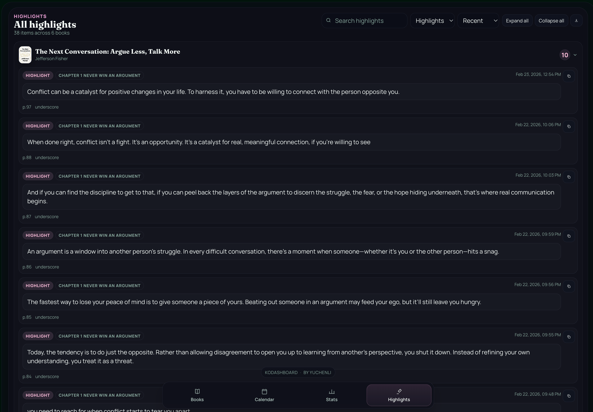

# Important Clarification

This plugin is primarily for my own use, and it's not intended to run as a continuously active web server on the Kindle. (unless you want to drain the device’s battery.)

The expected workflow is:

- Launch the plugin when needed

- Briefly access the dashboard from a phone or computer on the same local network

- Stop the server after reviewing the data

**It is designed for short, on-demand sessions rather than persistent background operation.**
**If you are looking for a continuously hosted or externally accessible solution, alternatives such as KOInsight (self-hosted) or KOStatsMulti (publicly hosted) may be more appropriate depending on your preferences.**

# KoDashboard

A KOReader plugin that starts a lightweight local web server and exposes a browser dashboard for your reading data.

Open it from any device on the same local network (phone, tablet, laptop) to explore your library, reading progress, statistics, calendar activity, and highlights/notes.

## Screenshots

### Books

<p align="center">
  
  
</p>

<p align="center">
  
</p>

### Calendar

<p align="center">
  
  
</p>

### Stats

<p align="center">
  
  
</p>

### Highlights

<p align="center">
  
</p>

## Features

- Runs directly inside KOReader
- Local web UI served by the plugin (`web/index.html`, `web/app.js`, `web/style.css`)
- JSON API for books, highlights, stats, overview, and dashboard data
- Bulk cover fetching (`Pull Covers`) with progress, pause/resume, and caching
- Highlights tools: copy single annotation + export all highlights (JSON)
- QR code shortcut in KOReader menu for quick mobile access
- Configurable port (default `8686`)
- Kindle support (opens/closes firewall rules when starting/stopping)

## Installation

### Install from ZIP (recommended)

1. Download the release ZIP.
2. Extract it.
3. Copy the `kodashboard.koplugin` folder into KOReader's `plugins` directory.
4. Restart KOReader.

Expected path:

```text
.../koreader/plugins/kodashboard.koplugin
```

## Usage

1. In KOReader, open the main menu.
2. Open the `KoDashboard` menu.
3. Tap `Start dashboard server`.
4. KOReader will show a local address (for example `http://192.168.1.23:8686`).
5. Open that URL in a browser on another device on the same Wi-Fi/network.
6. Or tap `Show QR code` in the `KoDashboard` menu and scan it from your phone/tablet.

### KOReader plugin menu options

- Start / Stop dashboard server
- Show QR code (starts the server if needed)
- Port (custom port setting)

## Cover Fetching (Pull Covers)

This is one of the core features of KoDashboard.

### How to use it

1. Open the dashboard in your browser.
2. Go to the `Books` tab.
3. Click `Pull Covers`.
4. Let the job run (you can `Pause` / `Resume`).
5. When complete, covers are refreshed in the library UI.

### What the progress panel means

- `saved`: a cover was newly saved (downloaded or extracted)
- `skipped`: a cached cover already exists
- `failed`: cover lookup/download failed
- `Current`: the book currently being processed
- Error list: sample failures (up to a few entries) to help troubleshooting metadata/network issues

### How cover fetching works

- KoDashboard tries local/embedded cover extraction first (when available).
- If no usable local cover is found, it can fall back to Open Library cover lookup/download.
- Downloaded covers are cached, so later runs usually skip existing covers.

### Important notes / caveats

- The KOReader device itself must have network access for online cover fetching.
- Your browser device (phone/laptop) only controls the UI; the fetch runs on the KOReader side.
- Cover matching depends on title/author metadata quality.
- Large libraries can take time depending on library size and network speed.
- Some books may remain without a fetched cover (metadata mismatch, missing result, network failure).

## Highlights: Copy and Download

KoDashboard supports both quick copying and bulk export of annotations.

### Copy a single annotation

From the `Highlights` page or a book detail page:

1. Find an annotation card.
2. Click the copy icon.
3. A formatted text block is copied to your clipboard.

The copied text can include:

- Book title
- Author
- Chapter
- Page
- Date
- Highlight text
- Note text

### Download (export) highlights

From the `Highlights` page:

1. Use search/filter/sort if needed.
2. Click the download icon (Export JSON).
3. KoDashboard downloads a file like:

```text
kodashboard-highlights-YYYY-MM-DD.json
```

The exported JSON includes structured rows such as:

- Book title / author
- Type (`highlight` or `note`)
- Color
- Chapter
- Page
- Datetime
- Highlight text
- Note text

## API Endpoints

All endpoints are `GET` only.

- `/api/books`
- `/api/books/:book_ref`
- `/api/books/:book_ref/annotations`
- `/api/books/:book_ref/timeline`
- `/api/books/:book_ref/cover`
- `/api/books/:book_ref/fetch-cover`
- `/api/highlights`
- `/api/stats`
- `/api/overview`
- `/api/dashboard`

## Notes

- Intended for local network use
- Server binds to all interfaces (`*`) on the configured port
- Static files are served from the plugin `web/` directory
- Only `GET` requests are supported by the built-in server

## Troubleshooting

- If the page does not load, confirm KOReader shows the server as running
- Make sure both devices are on the same network
- Try a different port if `8686` is occupied
- If covers fail to fetch, verify internet access on the KOReader device and check book metadata quality
- On Kindle, restarting the plugin can help if firewall rules were not applied cleanly

## Project Structure

- `main.lua` - plugin entry point and HTTP server
- `api.lua` - API routing and JSON responses
- `dataloader.lua` - data loading/parsing from KOReader data sources
- `web/` - frontend dashboard UI

## Credits

- [Fable](https://fable.co/) (design inspiration for reading/social reading UX ideas)
- [KoInsight by GeorgeSG](https://github.com/GeorgeSG/KoInsight) (inspiration/reference for KOReader reading insights work)
